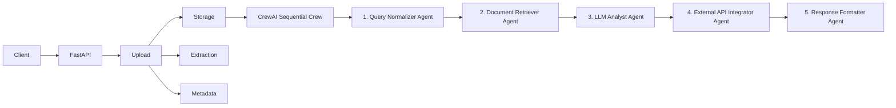

# BTP Use Case: Red Teaming for Privacy of Unstructured Data in Agents

This prototype implements a clean separation between document ingestion and agent orchestration. The goal is to keep a simple, extensible architecture ready for future privacy red-teaming at both the agent and crew levels.

> **Framework**: The orchestration backend uses **CrewAI** (migrated from LangGraph). The pipeline is a five-agent sequential crew that mirrors the original LangGraph node graph exactly.

---

## Architecture



---

## Project Purpose

- Ingest unstructured documents through a FastAPI service.
- Store the original artifact without conflating it with extracted text.
- Extract text in a provider-agnostic way (PDF, DOCX, TXT).
- Preserve metadata and storage references.
- Orchestrate a **CrewAI** sequential workflow independently of the API layer.
- Keep boundaries ready for future privacy auditing, red-teaming, logging, and data-flow analysis.

---

## Directory Structure

```
src/btp_usecase/
├── api/                   # FastAPI route and dependency wiring
│   ├── dependencies.py    # Provides get_document_service(), get_agent_crew()
│   └── routes/
│       ├── agent.py       # POST /agent/run
│       ├── health.py      # GET  /health
│       └── upload.py      # POST /documents/upload, GET /documents/{id}
├── core/                  # Configuration (pydantic-settings) and logging
│   ├── config.py
│   └── logging.py
├── crew/                  # CrewAI orchestration layer
│   ├── agents.py          # Factory functions for each named Agent
│   ├── tasks.py           # Factory functions for each sequential Task
│   └── crew.py            # build_crew() + run_crew() – main entry point
├── llm/                   # LLM provider abstraction
│   ├── base.py            # Abstract LLMProvider
│   ├── factory.py         # get_llm_provider(settings)
│   └── ollama_provider.py # Ollama HTTP client
├── models/                # Domain models and API payloads (Pydantic + dataclasses)
│   ├── api.py             # AgentRunRequest, DocumentUploadResponse
│   └── document.py        # ExtractedDocument, DocumentMetadata, DocumentUploadResult
├── services/              # Business logic
│   ├── agent_service.py   # AgentService – storage → extraction → run_crew
│   ├── document_service.py
│   ├── extraction_service.py  # PDF / DOCX / TXT extractors
│   └── metadata_service.py
└── storage/               # Storage abstraction
    ├── base.py            # Abstract DocumentStorage
    └── local.py           # LocalDocumentStorage (filesystem)

tests/
├── test_agent_service.py  # AgentService with mocked run_crew
├── test_extraction.py     # PDF / DOCX / TXT extractor unit tests
├── test_graph.py          # CrewAI build_crew + run_crew contract tests
├── test_storage.py        # LocalDocumentStorage save/get/delete
└── test_upload.py         # DocumentService upload validation
```

---

## CrewAI Pipeline – Five-Agent Crew

Each agent in the crew maps directly to a step in the former LangGraph node graph:

| Step | Agent Role | Task |
|------|-----------|------|
| 1 | **Query Normalizer** | Strip and validate the user query |
| 2 | **Document Retriever** | Surface the document text as context |
| 3 | **LLM Analyst** | Answer the query using only the document context |
| 4 | **External API Integrator** | Record external API call metadata |
| 5 | **Response Formatter** | Collate and return the final polished answer |

The crew runs with `Process.sequential` — each task receives all prior tasks as `context`, so each agent sees the outputs of every preceding step.

---

## Installation

```bash
cd BTP_Red_Teaming
uv venv
# Windows
.venv\Scripts\activate
# Linux / macOS
source .venv/bin/activate

uv sync
```

---

## Environment Variables

Copy `.env.example` to `.env` and fill in values:

```bash
cp .env.example .env   # Linux/macOS
copy .env.example .env  # Windows
```

| Variable | Default | Description |
|----------|---------|-------------|
| `APP_NAME` | `btp-usecase` | Application name |
| `ENVIRONMENT` | `development` | Runtime environment |
| `STORAGE_DIRECTORY` | `./data/documents` | Where uploaded files are stored |
| `MAX_UPLOAD_SIZE_MB` | `10` | Maximum file size in megabytes |
| `ALLOWED_FILE_TYPES` | `pdf,txt,docx` | Comma-separated allowed extensions |
| `LLM_PROVIDER` | `ollama` | LLM backend (`ollama` supported) |
| `LLM_MODEL` | `llama3.2` | Model name passed to Ollama |
| `OLLAMA_BASE_URL` | `http://localhost:11434` | Ollama server address |
| `API_KEY` | _(empty)_ | Optional API key for the prototype |

---

## Run the FastAPI Server

```bash
uv run uvicorn btp_usecase.main:app --reload
```

Open in browser:

- **Swagger UI** → `http://localhost:8000/docs`
- **Health check** → `http://localhost:8000/health`

---

## Upload a Document

```bash
curl -X POST "http://localhost:8000/documents/upload" \
  -F "file=@sample.pdf"
```

Response:
```json
{
  "document_id": "9f4a...",
  "content": "Extracted text...",
  "metadata": { "file_type": "pdf", "page_count": 3, ... },
  "storage_reference": "./data/documents/9f4a....pdf"
}
```

---

## Invoke the CrewAI Agent

### Via REST API

```bash
curl -X POST "http://localhost:8000/agent/run" \
  -H "Content-Type: application/json" \
  -d '{
    "user_query": "Summarize the uploaded document",
    "document_id": "9f4a..."
  }'
```

Or pass document text directly (no prior upload needed):

```bash
curl -X POST "http://localhost:8000/agent/run" \
  -H "Content-Type: application/json" \
  -d '{
    "user_query": "What is this document about?",
    "document_text": "This document describes privacy red-teaming methods."
  }'
```

### Via Python

```python
from btp_usecase.crew.crew import run_crew

result = run_crew(
    user_query="Summarize the uploaded document",
    document_id="doc-123",
    document_text="This is a sample document for the privacy prototype.",
)
print(result["final_response"])
```

Response dict shape (identical to the old LangGraph output):

```python
{
    "document_id": "doc-123",
    "final_response": "...",
    "messages": ["Summarize the uploaded document"],
    "intermediate_results": {
        "llm": {
            "provider": "ollama",
            "model": "llama3.2",
            "response": "..."
        }
    }
}
```

---

## Component Interaction

1. **FastAPI** receives a multipart file upload.
2. `DocumentService` validates filename, extension, and size, then stores the raw bytes.
3. The extraction layer (`ExtractionService`) normalises document text for PDF / DOCX / TXT.
4. `MetadataService` records file details without embedding content in the storage ID.
5. `AgentService.run_agent()` calls `run_crew()` which:
   - Builds a five-agent `Crew` with `Process.sequential`.
   - Kicks off `.kickoff()` and returns a result dict.
6. Each agent in the crew remains small, individually-testable, and auditable.

---

## Running Tests

```bash
uv run pytest -v
```

Expected output (10 tests, all passing):

```
tests/test_agent_service.py::test_agent_service_reads_document_from_storage  PASSED
tests/test_extraction.py::test_txt_extractor_extracts_text                   PASSED
tests/test_extraction.py::test_pdf_extractor_handles_empty_bytes             PASSED
tests/test_extraction.py::test_docx_extractor_supports_basic_document        PASSED
tests/test_graph.py::test_build_crew_returns_crew_instance                   PASSED
tests/test_graph.py::test_run_crew_returns_expected_keys                     PASSED
tests/test_storage.py::test_storage_save_and_retrieve                        PASSED
tests/test_upload.py::test_upload_valid_txt_file                             PASSED
tests/test_upload.py::test_reject_unsupported_extension                      PASSED
tests/test_upload.py::test_reject_oversized_file                             PASSED

10 passed in ~8s
```

---

## Future Extension Points

- **Add cloud storage**: Implement `S3DocumentStorage` or `AzureBlobStorage` under `storage/`.
- **Better extraction**: Add edge-case handling for malformed PDFs and complex DOCX layouts.
- **PII detection**: Add a dedicated Privacy Auditor agent between the LLM and Response steps.
- **Hierarchical crew**: Swap `Process.sequential` for `Process.hierarchical` to add a manager agent that can route tasks dynamically.
- **Vector retrieval**: Add a `DocumentRetriever` abstraction backed by a persistent vector database (e.g. ChromaDB — already installed as a CrewAI transitive dependency).
- **More LLM providers**: Extend `llm/factory.py` with OpenAI, Anthropic, or Gemini providers.
- **Data-flow monitors**: Insert audit/logging agents to track information flow for red-team analysis.
